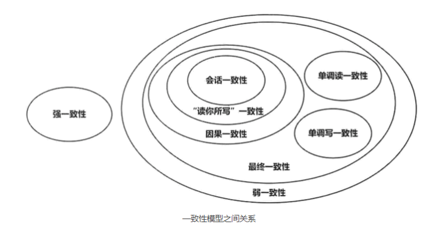

[分布式理论之BASE理论](https://segmentfault.com/a/1190000018019595)

### 什么是BASE理论

BASE是由Basically Available(基本可用)，Soft state（软状态）,和 Eventually consistent（最终一致性）三个短语的缩写。

### 为什么会出现BASE理论

#### CAP定理只能三选二

CAP 理论表明，对于一个分布式系统而言，它是无法同时满足 Consistency(强一致性)、Availability(可用性) 和 Partition tolerance(分区容忍性) 这三个条件的，最多只能满足其中两个。

#### 分区容错必须选

对于互联网来说，由于网络环境是不可信的，所以分区容错性（P）必须满足

#### 为了用户体验，先选可用性

现在只能在一致性和可用性之间做选择，大部分情况下，大家都会选择牺牲一部分的一致性来保证可用性，因为你不返回给用户数据，这体验也太差了，宁可拒绝服务也不能说能访问却没有数据，当然，严格场景下，比如支付场景，强一致性是必须要满足，这另说。

#### 但是放弃了一致性的系统又失去了存在的意义

好了，我们只能放弃一致性，但是我们真这样做了，将一致性放弃了，现在这个系统返回的数据你敢信吗？没有一致性，系统中的数据也就从根本上变得不可信了，那这数据拿来有什么用，那这个系统也就没有任何价值，根本没用。

如上所述，由于我们三者都无法抛弃，但CAP定理限制了我们三者无法同时满足，这种情况，我们会选择尽量靠近CAP定理，即尽量让C、A、P都满足，在此大势所趋下，出现了BASE定理。

## 核心思想

强一致性（Strong consistency）无法得到保障时（分区容错和可用性满足系统），我们可以根据业务自身的特点，采用适当的方式来达到最终一致性（Eventual consistency）

## 名词解释

### Basically Available(基本可用)

基本可用是相对于正常的系统来说的,常见如下情况

- 响应时间上的损失：正常情况下的搜索引擎0.5秒即返回给用户结果，而基本可用看的搜索结果可能要1秒，2秒甚至3秒（超过3秒用户就接受不了了）
- 功能上的损失：在一个电商网站上，正常情况下，用户可以顺利完成每一笔订单，但是到了促销时间，可能为了应对并发，保护购物系统的稳定性，部分用户会被引导到一个降级页面

### Soft state（软状态）

软状态是相对原子性来说的

- 原子性（硬状态） -> 要求多个节点的数据副本都是一致的,这是一种"硬状态"
- 软状态（弱状态） -> 允许系统中的数据存在中间状态,并认为该状态不影响系统的整体可用性,即允许系统在多个不同节点的数据副本存在数据延迟

### Eventually consistent（最终一致性）

> 弱一致性
>
> 和强一致性相对
>
> 系统并不保证连续进程或者线程的访问都会返回最新的更新过的值。系统在数据写入成功之后，
>
> 不承诺立即可以读到最新写入的值
>
> ，也不会具体的承诺多久之后可以读到。但会
>
> 尽可能保证在某个时间级别（比如秒级别）之后，可以让数据达到一致性状态
>
> 。
>
> **最终一致性是弱一致性的特定形式**

> 亚马逊CTO Werner Vogels在于2008年发表的一篇文章中对最终一致性进行了非常详细的介绍
> [【英文】All Things Distributed](https://www.allthingsdistributed.com/2008/12/eventually_consistent.html)
> [【译】最终一致性](http://gaosboy.com/2010/01/16/eventually_consistent.html)

> **官方解释**
> 系统能够保证在没有其他新的更新操作的情况下，数据最终一定能够达到一致的状态，因此所有客户端对系统的数据访问最终都能够获取到最新的值。

对于软状态,我们允许中间状态存在，但不可能一直是中间状态，必须要有个期限，系统保证在没有后续更新的前提下,在这个期限后,系统最终返回上一次更新操作的值,从而达到数据的最终一致性,这个容忍期限（不一致窗口的时间）取决于通信延迟，系统负载，数据复制方案设计，复制副本个数等，DNS是一个典型的最终一致性系统。

#### 最终一致性模型变种

- 因果一致性（Causal consistency）

如果节点A在更新完某个数据后通知了节点B,那么节点B的访问修改操作都是基于A更新后的值,同时,和节点A没有因果关系的C的数据访问则没有这样的限制

- 读己之所写（Read your writes）

因果一致性的特定形式，一个节点A总可以读到自己更新的数据

- 会话一致性（Session consistency）

访问存储系统同一个有效的会话，系统应保证该进程读己之所写

- 单调读一致性（Monotonic read consistency）

一个节点从系统中读取一个特定值之后，那么该节点从系统中不会读取到该值以前的任何值

- 单调写一致性（Monotonic write consistency）

一个系统要能够保证来自同一个节点的写操作被顺序执行（保证写操作串行化）

实践中，往往5个系统进行排列组合，当然，不只是分布式系统使用最终一致性，关系型数据库在某个功能上，也是使用最终一致性的，比如备份，数据库的复制过程是需要时间的，这个复制过程中，业务读取到的值就是旧的。当然，最终还是达成了数据一致性。这也算是一个最终一致性的经典案例

## BASE和ACID的区别与联系

> 参考ACID维基百科
>
> ACID，是指数据库管理系统（DBMS）在写入或更新资料的过程中，为保证事务（transaction）是正确可靠的，所必须具备的四个特性：原子性（atomicity，或称不可分割性）、一致性（consistency）、隔离性（isolation，又称独立性）、持久性（durability）
>
> 原子性：一个事务（transaction）中的所有操作，要么全部完成，要么全部不完成，不会结束在中间某个环节。事务在执行过程中发生错误，会被回滚（Rollback）到事务开始前的状态，就像这个事务从来没有执行过一样。
>
> 一致性：在事务开始之前和事务结束以后，数据库的完整性没有被破坏。这表示写入的资料必须完全符合所有的预设规则，这包含资料的精确度、串联性以及后续数据库可以自发性地完成预定的工作。
>
> 隔离性：数据库允许多个并发事务同时对齐数据进行读写和修改的能力，隔离性可以防止多个事务并发执行时由于交叉执行而导致数据的不一致。事务隔离分为不同级别，包括读未提交（Read uncommitted）、读提交（read committed）、可重复读（repeatable read）和串行化（Serializable）。
>
> 持久性：事务处理结束后，对数据的修改就是永久的，即便系统故障也不会丢失。

- ACID是传统数据库常用的设计理念, 追求强一致性模型。
- BASE支持的是大型分布式系统，提出通过牺牲强一致性获得高可用性。

ACID和BASE代表了两种截然相反的设计哲学。

总的来说，BASE 理论面向大型高可用可扩展的分布式系统，与ACID这种强一致性模型不同，常常是牺牲强一致性来获得可用性，并允许数据在一段时间是不一致的。虽然两者处于【一致性-可用性】分布图的两级，但两者并不是孤立的，对于分布式系统来说，往往依据业务的不同和使用的系统组件不同，而需要灵活的调整一致性要求，也因此，常常会组合使用ACID和BASE。

