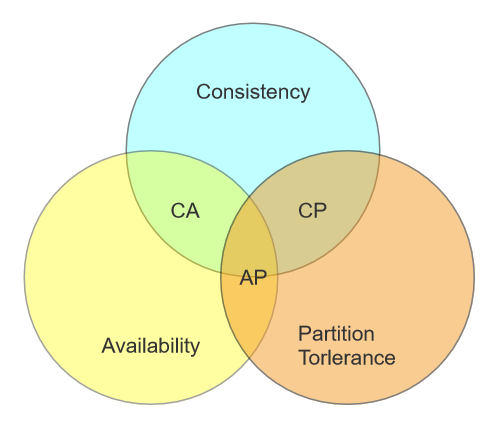
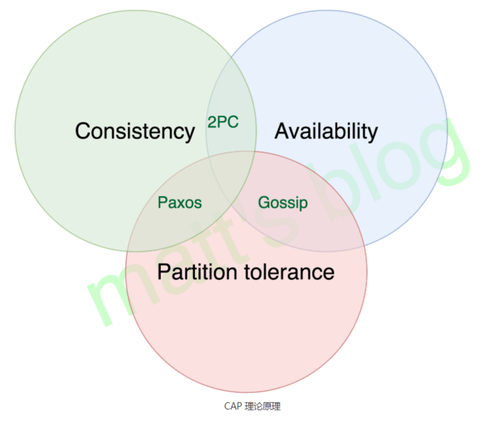

# CAP定理

[阮一峰的网络日志](http://www.ruanyifeng.com/blog/2018/07/cap.html)

[[分布式理论之CAP定理（布鲁尔定理）](https://segmentfault.com/a/1190000018011851)](https://segmentfault.com/a/1190000018011851)

1998年，加州大学的计算机科学家 Eric Brewer 提出，分布式系统有三个指标。

- Consistency 一致性
- Availability 可用性
- Partition tolerance 分区容错性

这三个指标不可能同时达到，这个结论叫做CAP定理。

## 解释每个指标

### 1. 一致性

**这里指的是强一致性，而最终一致性后续讨论**

在写操作完成后开始的任何读操作都必须返回该值，或者后续写操作的结果
也就是说，在一致性系统中，一旦客户端将值写入任何一台服务器并获得响应，那么之后client从其他任何服务器读取的都是刚写入的数据

### 2. 可用性

系统中非故障节点收到的每个请求都必须有响应
在可用系统中，如果我们的客户端向服务器发送请求，并且服务器未崩溃，则服务器必须最终响应客户端，不允许服务器忽略客户的请求

### 3. 分区一致性

允许网络丢失从一个节点发送到另一个节点的任意多条消息，即不同步。即分布式系统要容忍两个分区因为网络问题不能通讯的情况。
也就是说，G1和G2发送给对方的任何消息都是可以放弃的，也就是说G1和G2可能因为各种意外情况，导致无法成功进行同步，分布式系统要能容忍这种情况。

## CAP如何权衡

**三选二利弊如何选择**

- CA (Consistency + Availability)：关注一致性和可用性，它需要非常严格的全体一致的协议，比如“两阶段提交”（2PC）。CA 系统不能容忍网络错误或节点错误，一旦出现这样的问题，整个系统就会拒绝写请求，因为它并不知道对面的那个结点是否挂掉了，还是只是网络问题。唯一安全的做法就是把自己变成只读的。
- CP (consistency + partition tolerance)：关注一致性和分区容忍性。它关注的是系统里大多数人的一致性协议，比如：Paxos 算法 (Quorum 类的算法)。这样的系统只需要保证大多数结点数据一致，而少数的结点会在没有同步到最新版本的数据时变成不可用的状态。这样能够提供一部分的可用性。
- AP (availability + partition tolerance)：这样的系统关心可用性和分区容忍性。因此，这样的系统不能达成一致性，需要给出数据冲突，给出数据冲突就需要维护数据版本。Dynamo 就是这样的系统。

### 如何进行三选二

**权衡三者的关键点取决于业务**
放弃了一致性，满足分区容错，那么节点之间就有可能失去联系，为了高可用，每个节点只能用本地数据提供服务，而这样会容易导致全局数据不一致性。对于互联网应用来说（如新浪，网易），机器数量庞大，节点分散，网络故障再正常不过了，那么此时就是保障AP，放弃C的场景，而从实际中理解，像门户网站这种偶尔没有一致性是能接受的，但不能访问问题就非常大了。

对于银行来说，就是必须保证强一致性，也就是说C必须存在，那么就只用CA和CP两种情况，当保障强一致性和可用性（CA），那么一旦出现通信故障，系统将完全不可用。另一方面，如果保障了强一致性和分区容错（CP），那么就具备了部分可用性。实际究竟应该选择什么，是需要通过业务场景进行权衡的（并不是所有情况都是CP好于CA，只能查看信息但不能更新信息有时候还不如直接拒绝服务）
