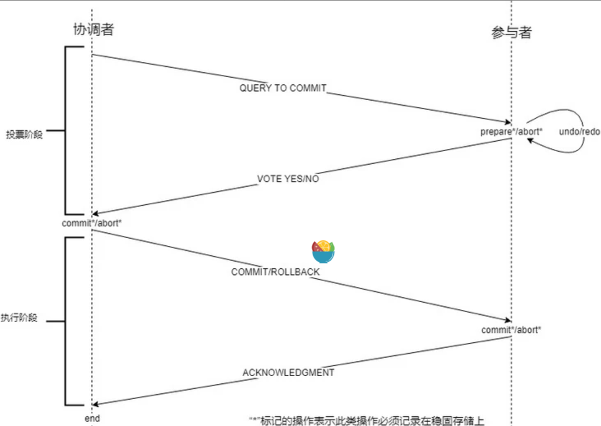

[分布式理论之2PC协议(2阶段提交协议)](https://segmentfault.com/a/1190000018058944)

## 目的

用以保证在分布式事务中，要么所有参与进程都提交事务，要么都取消事务，即实现ACID的原子性（A）。在数据一致中，它的含义是：要么所有副本（备份数据）同时修改某个数值，要么都不更改，以此来保证数据的强一致性。

## 知识预备 - [预写式日志(Write-Ahead logging(WAL))](https://segmentfault.com/a/1190000018058484)

> 在计算机科学中，预写式日志（Write-ahead logging，缩写 WAL）是关系数据库系统中用于提供原子性和持久性（ACID属性中的两个）的一系列技术

## 二阶段提交算法成立的基本假设

- 分布式系统中,存在一个节点作为协调者,其他节点作为参与者
- 所有节点都采用预写式日志,且日志被写入后即被保持在可靠的存储设备上,即使节点损坏也不会导致日志数据消失
- 所有节点不会永久性损坏,即使损坏后仍然可以恢复,且节点之间可以互相通信

***基本假设是有风险的***

- 所有节点可以互相通信,这个一般不是什么大问题,通常可以重新路由网络通信
- 所有节点不会永久损坏,这个问题很大,比如服务器炸了

## 二阶段提交具体操作

### 提交请求阶段(投票阶段)

第一阶段也被称作**投票阶段**，即各参与者投票是否要继续接下来的提交操作

1. 协调者节点向所有参与者节点询问是否可以执行提交操作（`QUERY TO COMMIT`），并开始等待各参与者节点的响应。
2. 参与者节点执行询问发起为止的所有事务操作，并将undo信息和redo信息写入日志([预写式日志](https://segmentfault.com/a/1190000018058484))。
3. 各参与者节点响应协调者节点发起的询问。如果参与者节点的事务操作实际执行成功，则它返回一个"同意"(`YES`)消息；如果参与者节点的事务操作实际执行失败，则它返回一个"中止"(`NO`)消息

### 提交执行阶段(执行阶段)

第二阶段也被称作完成阶段，因为无论结果怎样，协调者都必须在此阶段结束当前事务。

#### 成功

当协调者节点从所有参与者节点获得的相应消息都为"同意"时：

1. 协调者节点向所有参与者节点发出"正式提交"(`COMMIT`)的请求。
2. 参与者节点正式完成操作，并释放在整个事务期间内占用的资源。
3. 参与者节点向协调者节点发送"完成"(`ACKNOWLEDGMENT`)消息。
4. 协调者节点收到所有参与者节点反馈的"完成"消息后，完成事务。

#### 失败

如果任一参与者节点在第一阶段返回的响应消息为"终止"，或者 协调者节点在第一阶段的询问超时之前无法获取所有参与者节点的响应消息时：

1. 协调者节点向所有参与者节点发出"回滚操作"(ROLLBACK)的请求。
2. 参与者节点利用之前写入的undo信息执行回滚，并释放在整个事务期间内占用的资源。
3. 参与者节点向协调者节点发送"回滚完成"(`ACKNOWLEDGMENT`)消息。
4. 协调者节点收到所有参与者节点反馈的"回滚完成"消息后，取消事务。

## 2PC是否可以在任何情况下都可以解决一致性问题

我们仅从理论上分析各种意外，因为实际的网络生产中，各种情况都有可能发生

### 协调者不同阶段宕机的不同现象

| 情况                               | 分析及解决方案                                               |
| ---------------------------------- | ------------------------------------------------------------ |
| 协调者挂了，参与者没挂             | 只要找一个协调者的替代者，新的协调者询问所有参与者它们最后那条事务的执行情况，新协调者就知道该做什么样的操作了。这种情况不会导致数据不一致 |
| 参与者挂了（无法恢复），协调者没挂 | 如果挂了之后没有恢复，则不会导致数据不一致                   |
| 参与者挂了（后来恢复），协调者没挂 | 恢复后参与者如果发现有未执行完的事务操作，直接取消，然后再询问协调者我应该怎么做，协调者就会比对自己的事务执行记录和该参与者的事务执行记录，告诉他应该怎么做来保持数据的一致 |
| 参与者挂了，协调者也挂了           | 需要再细分为几种类型来讨论，如下                             |

**参与者挂了，协调者也挂了的情况**

- 协调者和参与者在投票阶段挂了
  - 由于这时还没有执行提交操作，新选出来的协调者可以询问各个参与者的情况，再决定是进行提交还是回滚。因为没有提交，不会导致数据不一致
- 协调者和参与者在执行阶段挂了，但是挂的这个参与者在挂之前还没有做相关操作
  1. 选出新的协调
  2. 协调者询问所有参与者的情况。
     - 有参与者执行了`roolback`操作或投票阶段返回的信息是`No`，那么协调者指导参与者执行`roolback`操作。
     - 如果存在参与者执行了`commit`操作且其余参与者没有`abort`，那么协调者就指导参与者执行`commit`操作。因为挂掉的机器并没有做 commit 或者 roolback 操作，而没有挂掉的机器们和新的协调者又执行了同样的操作，那么这种情况不会导致数据不一致现象
- 协调者和参与者在第二阶段挂了，挂的这个参与者在挂之前已经执行了操作
  - **挂的参与者没有恢复**：这种情况下，就变成和上述情况一致了，因为即使执行了，永远没有恢复就和没有执行时一样的。所以此时不会导致数据不一致现象
  - **挂掉的参与者恢复了**：由于参与者在挂之前执行了操作，此时是没有人知道它执行了什么操作，它已经执行完了之前的事务
    - 如果它执行的是`commit`：此时这个挂掉且恢复的参与者和其它参与者保持一致了
    - 如果它执行的是`roolback`：**此时会导致数据的不一致**，虽然这个时候可以再通过手段让他和协调者通信，再想办法把数据变成一致的，但是，这段时间内他的数据状态已经是不一致了

### 小结

**2PC协议中，如果出现协调者和参与者都挂了的情况，有可能导致数据不一致**。为了解决这个问题，衍生出了3PC，这是后话。

## 2PC 优缺点和解决方案

### 优缺点

- 优点：原理简洁清晰、实现方便；
- 缺点：同步阻塞、单点问题、某些情况可能导致数据不一致。

### 解决方案

关于这几个缺点，在实际应用中，都是对2PC 做了相应的改造：

- 同步阻塞：2PC 有几个过程（比如协调者等待所有参与者表决的过程中）都是同步阻塞的，在实际的应用中，这可能会导致长阻塞问题，这个问题是通过超时判断机制来解决的，但并不能完全解决同步阻塞问题；
- 协调者单点问题：实际生产应用中，协调者都会有相应的备选节点；
- 数据不一致：在提交阶段，协调者和参与者都出现挂掉的情况下，是有可能导致数据不一致的，衍生出了3PC。

## 总结

在分布式系统中，每个节点可以知道自己的操作是成功还是失败，但无法知道其他节点的操作状态，为了在跨多个节点的事务中保持事务的ACID特性，我们会引入一个“协调者”的组件来统一掌握所有节点（参与者）的操作状态，并指示这些节点（参与者）是否需要把操作结果进行真正的提交（比如将更新后的数据写入磁盘等等）。
因此，**二阶段提交的算法思路可以概括为：参与者将操作结果通知协调者，在由协调者根据所有参与者的反馈情报决定各参与者是否要提交操作还是中止操作**