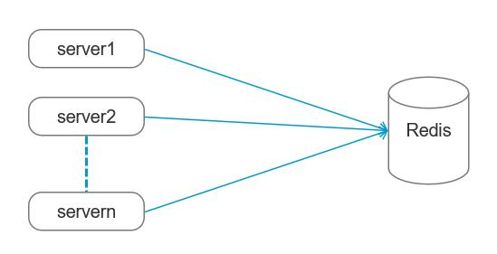
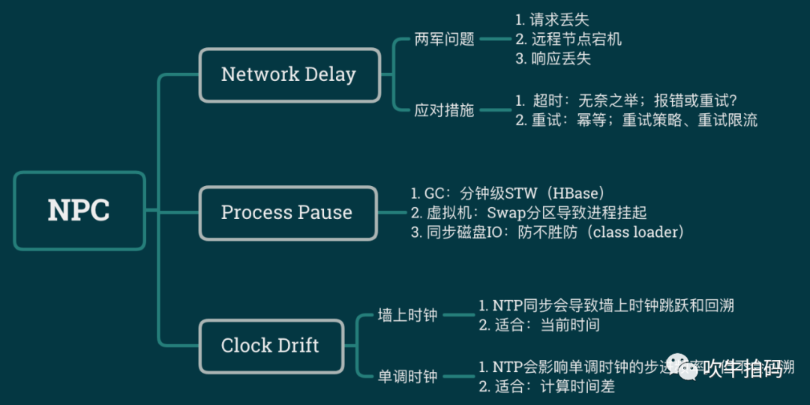

[TOC]

# 分布式锁

分布式锁是为了解决在并行情况下DB数据的一致性，承诺可以保证多台应用server同一时刻只有一个线程可以修改DB

## 一、 实现方式

### 1. 使用Redis实现分布式锁

==使用Redis的可行性：==因为Redis是单线程模型，因此不需要考虑并发安全性。这里的单线程是指网络请求模块使用了一个线程

Setnx（SET if Not eXists） 命令在指定的 key 不存在时，为 key 设置指定的值  

这个命令只有在key不存在使可以为key设定值，key存在时不能修改value。因此让每个服务器尝试修改DB时都先判断Redis中的key是否存在，这样便实现了分布式锁。  

当服务器1拿到锁之后，处理完业务，需要将锁释放掉。锁释放掉之后其他的服务就可以再请求锁了。

**这样处理仍会有死锁的问题**，例如服务1获取锁之后发生了宕机，那么其他的服务就永远都不能得到执行了。为了解决这个思索问题，**可以为key设置超时时间，超时释放**

### Zookeeper

使用zookeeper中的临时节点，当服务器发生宕机时，临时节点会自动消失，

> 但是我们可能还需要注意到一点，就是惊群效应：举一个很简单的例子，当你往一群鸽子中间扔一块食物，虽然最终只有一个鸽子抢到食物，但所有鸽子都会被惊动来争夺，没有抢到…
>
> 就是当服务器1节点有变化，会通知其余的99个服务器，但是最终只有1个服务器会创建成功，这样98还是需要等待监听，那么为了处理这种情况，就需要用到临时顺序性节点。大致意思就是，之前是所有99个服务器都监听一个节点，现在就是每一个服务器监听自己前面的一个节点。
>
> 假设100个服务器同时发来请求，这个时候会在/zkjjj节点下创建100个临时顺序性节点/zkjjj/000000001，/zkjjj/000000002，一直到/zkjjj/000000100，这个编号就等于是已经给他们设置了获取锁的先后顺序了。
>
> 当001节点处理完毕，删除节点后，002收到通知，去获取锁，开始执行，执行完毕，删除节点，通知003~以此类推。

## **数据一致性模型**

一些分布式系统通过复制数据来提高系统的可靠性和容错性，并且将数据的不同的副本存放在不同的机器。

1. 强一致性：
   当更新操作完成之后，任何多个后续进程或者线程的访问都会返回最新的更新过的值。这种是对用户最友好的，就是用户上一次写什么，下一次就保证能读到什么。根据 CAP 理论，这种实现需要牺牲可用性。

2. 弱一致性：
   系统并不保证续进程或者线程的访问都会返回最新的更新过的值。用户读到某一操作对系统特定数据的更新需要一段时间，我们称这段时间为“不一致性窗口”。系统在数据写入成功之后，不承诺立即可以读到最新写入的值，也不会具体的承诺多久之后可以读到。

3. 最终一致性：
   是弱一致性的一种特例。系统中的所有分散在不同节点的数据，经过一定时间后，最终能够达到符合业务定义的一致的状态。DNS

## NPC问题
**NPC问题，N指网络延迟，P指Process Pause进程暂停，C指Clock drift时钟漂移**

1. Network Delay，网络延迟。虽然网络在多数情况下工作的还可以，虽然TCP保证传输顺序和不会丢失，但它无法消除网络延迟问题。一个糟糕的例子是：客户正紧张的坐在屏幕前等待下单结果，服务器也已下单成功，但在返回的确认响应在网络上迷失了，也就是走丢了。
2. Process Pause，进程暂停。有很多种原因可以导致进程暂停：比如编程语言中的GC（垃圾回收机制）会暂停所有正在运行的线程；再比如，我们有时会暂停云服务器，从而可以在不重启的情况下将云服务器从一台主机迁移到另一台主机。我们无法确定性预测进程暂停的时长，你以为持续几百毫秒已经很长了，但实际上持续数分钟之久进程暂停并不罕见。
3. Clock Drift，时钟漂移。现实生活中我们通常认为时间是平稳流逝，单调递增的，但在计算机中不是。计算机使用时钟硬件计时，通常是石英钟，计时精度有限，同时受机器温度影响。为了在一定程度上同步网络上多个机器之间的时间，通常使用NTP协议将本地设备的时间与专门的时间服务器对齐，这样做的一个直接结果是设备的本地时间可能会突然向前或向后跳跃。

## 参考文献

[1](https://mp.weixin.qq.com/s/hOPT41HIAGE8iZ5jLlREmg)  13.看似忠良的分布式锁

[2](https://zhuanlan.zhihu.com/p/72896771) 通俗讲解分布式锁，看完不懂算作者输
