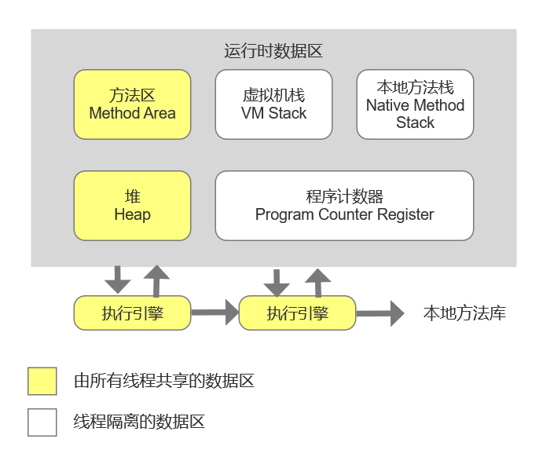

[TOC]

## 1. 内存模型

JVM 内存共分为虚拟机栈，堆，方法区，程序计数器，本地方法栈五个部分。

==线程私有：==栈，本地方法栈，程序计数器

==线程共享：==方法区，堆

**1. 虚拟机栈**

又称方法栈,线程私有的,线程执行方法是都会创建一个栈帧,用来存储局部变量表,操作栈,动态链接,方 法出口等信息.调用方法时执行入栈,方法返回式执行出栈. 

**栈帧（Stack Frame）**：
每个方法被执行的时候Java虚拟机都会同步创建一个栈帧，用于存储局部变量表、操作数栈、动态链接、方法出口等信息。每一个方法被调用直至执行完毕的过程，就对应着一个栈帧在虚拟机栈中从入栈到出栈的过程。

**2. 本地方法栈**

与栈类似,也是用来保存执行方法的信息.执行Java方法是使用栈,执行Native方法时使用本地方法栈. 

**3. 程序计数器**

字节码解释器工作就是通过改变PC的值来选取下一条需要执行的字节码指令。

- 如果线程正在执行的是一个Java方法，这个计数器记录的是正在执行的虚拟机字节码指令的地址
- 如果正在执行的是本地（Nativate）方法，这个计数器值则应该为空（Undefined）

**4. 堆** 

JVM内存管理最大的一块,对被线程共享,目的是存放对象的实例,几乎所有的对象实例都会放在这里, 当堆没有可用空间时,会抛出OOM异常.根据对象的存活周期不同,JVM把对象进行分代管理,由垃圾回 收器进行垃圾的回收管理 。

内存分配时，可以划分出多个线程分配缓冲区(Thread Local Allocation Buffer, TLAB)，哪个线程要分配内存，就在哪个线程的本地缓冲区中分配，本地缓冲区用完了，分配新的缓冲区时才需要同步锁定。

**5. 方法区**

用于存储已被虚拟机加载的类信息,常量,静态变量,即时编译器优化后的代码缓存等数据

**6. 运行时常量池**

运行时常量池是方法区的一部分。Class文件中除了有类的版本，字段，方法，接口等描述信息外，还有一项信息是==常量池表(Constant Pool Table)==，用于存放编译期生成的各种字面量与符号引用，这部分内容将在类加载后存放到方法区的运行常量池中。

**7. 直接内存**

指计算机的直接内存，这部分没有在虚拟机中。

## 2. 分代理论

1）弱分代假说：绝大多数对象的生命周期都很短，绝大多数的对象都是朝生夕灭的。

2）强分代假说：熬过越多次垃圾收集过程的对象越难以消亡。

todo ...

