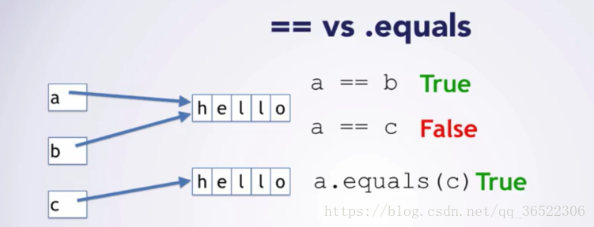
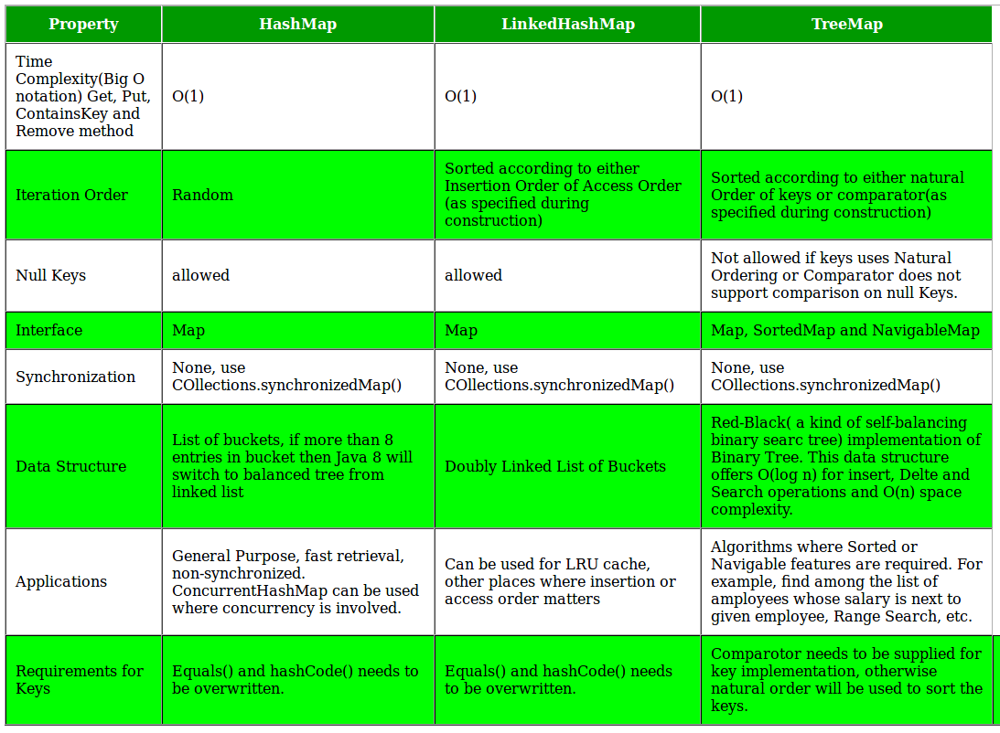
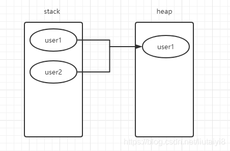
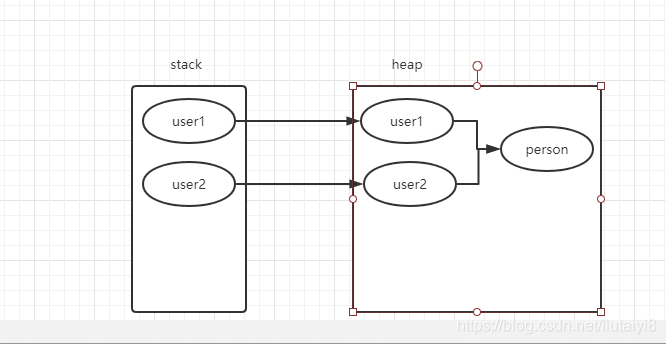

[TOC]

# 一、Java 基础

## 1. Java自动装箱与拆箱 

装箱就是自动将基本数据类型转换为包装器类型（int-->Integer）；调用方法：Integer的 valueOf(int) 方法 

拆箱就是自动将包装器类型转换为基本数据类型（Integer-->int）。调用方法：Integer的 intValue方法


## 2. ==与equals的区别

[==与equals的区别](https://blog.csdn.net/qq_36522306/article/details/80550210)

> 1、基本数据类型：比较的是他们的值是否相等，比如两个int类型的变量，比较的是变量的值是否一样。
> 其中基本数据类型有8个：byte(8位)、short(16位)、int(32位)、long(64位)、float(32位)、double(64位)、char(16位)、boolean(true和false)。
> 八大基本数据类型对应着各自的封装类型，提供了更多的方法，且不进行初始化时，值默认为空（基本数据类型必须初始化）。
> 2、引用数据类型：比较的是引用的地址是否相同，比如说新建了两个User对象，比较的是两个User的地址是否一样。

1.  ==是判断两个变量或实例是不是指向同一个内存空间，equals是判断两个变量或实例所指向的内存空间的值是不是相同 
2.  ==是指对内存地址进行比较 ， equals()是对字符串的内容进行比较
3.  ==指引用是否相同， equals()指的是值是否相同



对于对象来讲，没有区别，都是判断地址是否相同：

```java
		TestEqu e1 = new TestEqu(1);
        TestEqu e2 = new TestEqu(1);

        System.out.println(e1==e2);
        System.out.println(e1.equals(e2));
```

结果

```java
false
false
```

对于基本数据类型来讲是不同的：

```java
		String a = new String("123");
        String b = new String("123");
        System.out.println(a==b);
        System.out.println(a.equals(b));
```

结果

```
false
true
```

### 2.1. 特殊情况

```java
public class Main {
 public static void main(String[] args) {
 
 Integer i1 = 100;
 Integer i2 = 100;
 Integer i3 = 200;
 Integer i4 = 200;
 
 System.out.println(i1==i2);
 System.out.println(i3==i4);
 }
}
```

运行结果

```
true
false
```

在通过valueOf方法创建Integer对象的时候，如果数值在[-128,127]之间， 便返回指向IntegerCache.cache中已经存在的对象的引用；否则创建一个新的Integer对象。


## 3. 重载与重写的区别

**重写**

从字面上看，重写就是 重新写一遍的意思。其实就是在子类中把父类本身有的方法重新写一遍。子 类继承了父类原有的方法，但有时子类并不想原封不动的继承父类中的某个方法，所以在方法名， 参数列表，返回类型(除过子类中方法的返回值是父类中方法返回值的子类时)都相同的情况下， 对 方法体进行修改或重写，这就是重写。但要注意子类函数的访问修饰权限不能少于父类的。

重写 总结： 1.发生在父类与子类之间 2.方法名，参数列表，返回类型（除过子类中方法的返回类型 是父类中返回类型的子类）必须相同 3.访问修饰符的限制一定要大于被重写方法的访问修饰符 （public>protected>default>private) 4.重写方法一定不能抛出新的检查异常或者比被重写方法申 明更加宽泛的检查型异常

**重载**

在一个类中，同名的方法如果有不同的参数列表（参数类型不同、参数个数不同甚至是参数顺序不 同）则视为重载。同时，重载对返回类型没有要求，可以相同也可以不同，但不能通过返回类型是 否相同来判断重载。


重载 总结： 1.重载Overload是一个类中多态性的一种表现 2.重载要求同名方法的参数列表不同(参 数类型，参数个数甚至是参数顺序) 3.重载的时候，返回值类型可以相同也可以不相同。无法以返回 型别作为重载函数的区分标准


## 4. 多态

### 4.1. 多态的优点

1. 消除类型之间的耦合关系
2. 可替换性
3. 可扩充性
4. 接口性
5. 灵活性
6. 简化性

### 4.2. 多态存在的三个必要条件

- 继承
- 重写
- 父类引用指向子类对象：**Parent p = new Child();**

### 4.3. 多态的实现方式

**方式一：重写：**

这个内容已经在上一章节详细讲过，就不再阐述，详细可访问：[Java 重写(Override)与重载(Overload)](https://www.runoob.com/java/java-override-overload.html)。

**方式二：接口**

- 生活中的接口最具代表性的就是插座，例如一个三接头的插头都能接在三孔插座中，因为这个是每个国家都有各自规定的接口规则，有可能到国外就不行，那是因为国外自己定义的接口类型。
- java中的接口类似于生活中的接口，就是一些方法特征的集合，但没有方法的实现。具体可以看 [java接口](https://www.runoob.com/java/java-interfaces.html) 这一章节的内容。

**方式三：抽象类和抽象方法**


## 5. String、String StringBuffer 和 StringBuilder

### 5.1. 结论

string是常量

stringbuilder线程不安全

stringbuffer线程安全

***\*运行速度快慢为：StringBuilder > StringBuffer > String\****

**String：适用于少量的字符串操作的情况**

**StringBuilder：适用于单线程下在字符缓冲区进行大量操作的情况**

**StringBuffer：适用多线程下在字符缓冲区进行大量操作的情况**


### 5.2. 原理

String是只读字符串，它并不是基本数据类型，而是一个对象。从底层源码来看是一个final类型的 字符数组，所引用的字符串不能被改变，一经定义，无法再增删改。每次对String的操作都会生成 新的String对象。

每次+操作 ： 隐式在堆上new了一个跟原字符串相同的StringBuilder对象，再调用append方法 拼 接+后面的字符。 StringBuffer和StringBuilder他们两都继承了AbstractStringBuilder抽象类，从 AbstractStringBuilder抽象类中我们可以看到

```java
/**
* The value is used for character storage.
*/
char[] value;
```

他们的底层都是可变的字符数组，所以在进行频繁的字符串操作时，建议使用StringBuffer和 StringBuilder来进行操作。 另外StringBuffer 对方法加了同步锁或者对调用的方法加了同步锁，所 以是线程安全的。StringBuilder 并没有对方法进行加同步锁，所以是非线程安全的。


## 6. ArrayList、LinkedList、Vector区别

1. 实现方式：

   ArrayList: 数组

   Vector: 数组

   LinkedList: 双向链表

2. 线程安全：

   ArrayList: 不安全

   Vector: 安全

   LinkedList: 不安全

3. 扩容：

   ArrayList:  初始容量是10，扩容是50%

   Vector: 初始容量是10，扩容是100%


## 7. HashMap

[参考资料1](https://blog.csdn.net/jiankunking/article/details/52673302)

[参考资料2](https://www.cnblogs.com/captainad/p/10905184.html)

1. HashMap底层结构实现方式

   ```java
   public class HashMap<K,V> extends AbstractMap<K,V>
   implements Map<K,V>, Cloneable, Serializable {
   ```

   - HashMap 继承自一个抽象类，实现了Map接口。HashMap是无序的，若要保持元素的输入顺序应该使用LinkedHashMap

   - 除了非同步和允许使用null之外，HashMap与Hashtable基本一致。此处的非同步指的是多线程访问，并至少一个线程修改HashMap结构。结构修改包括任何新增、删除映射，但仅仅修改HashMap中已存在项值得操作不属于结构修改。

   - 初始容量与加载因子是影响HashMap的两个重要因素。 

     > public HashMap(int initialCapacity, float loadFactor)

     - ```java
       /**
        * The default initial capacity - MUST be a power of two.
        */
       static final int DEFAULT_INITIAL_CAPACITY = 1 << 4; // aka 16
       
       /**
        * The maximum capacity, used if a higher value is implicitly specified
        * by either of the constructors with arguments.
        * MUST be a power of two <= 1<<30.
        */
       static final int MAXIMUM_CAPACITY = 1 << 30;
       
       /**
        * The load factor used when none specified in constructor.
        */
       static final float DEFAULT_LOAD_FACTOR = 0.75f;
       ```

       容量是HashMap在创建时“桶”的数量，而初始容量是哈希表在创建时分配的空间大小。加载因子是哈希表在其容量自动增加时能达到多满的衡量尺度（比如默认为0.75，即桶中数据达到3/4就不能再放数据了）。

       > 默认的负载因子大小为0.75，也就是说，当一个map填满了75%的bucket时候，和其它集合类(如ArrayList等)一样，将会创建原来HashMap大小的两倍的bucket数组，来重新调整map的大小，并将原来的对象放入新的bucket数组中。这个过程叫作rehashing，因为它调用hash方法找到新的bucket位置。
       >
       > **HashMap应该避免在多线程环境下使用**

       默认0.75这是时间和空间成本上一种折衷：增大负载因子可以减少 Hash 表（就是那个 Entry 数组）所占用的内存空间，但会增加查询数据的时间开销，而查询是最频繁的的操作（HashMap 的 get() 与 put() 方法都要用到查询）；减小负载因子会提高数据查询的性能，但会增加 Hash 表所占用的内存空间。

   - put 使用尾插法

   - 触发resize的条件有两个：1. 列表的使用率超过了threshold  (HashMap的长度initialCapacity×loadFactor)    2. 一个链的长度超过8

   - 由链表变成树（红黑树）的条件为：链表长度超过64

2. Hashmap为什么2倍扩容？
   [为什么2倍扩容](https://blog.csdn.net/soulofball/article/details/108951697)

   ```java
   n = table.length();       //n在这里是HashMap的长度，而长度一定是2的倍数
   index = (n - 1) & hash
   ```

   这种计算方式可以减少哈希碰撞的几率，扩容为2的幂，可以保证不容易产生碰撞，

   如果是4倍，则会浪费空间

3. HashMap,TreeMap,LinkedHashMap的区别

   [HashMap,TreeMap,LinkedHashMap的区别](https://www.cnblogs.com/natian-ws/p/10762213.html)

   Output of HashMap:

   ```
   -1, 0, 1, -2, 2,     
   // ordering of the keys is essentially arbitrary (any ordering)
   ```

   Output of LinkedHashMap:

   ```
    1, -1, 0, 2, -2,     
   // Keys are ordered by their insertion order
   ```

   Output of TreeMap:

   ```
    -2, -1, 0, 1, 2,   
   // Keys are in sorted order
   ```

   

   LinkedHash在其他地方与Hashmap完全相同，只是在创建新的Node时不同，用一个双向链表来维持所有的节点，保证输出时可以按照插入顺序进行输出


## 8. HashMap和HashTable的区别

1. 两者父类不同

   HashMap是继承自AbstractMap类，而Hashtable是继承自Dictionary类。不过它们都实现了同时 实现了map、Cloneable（可复制）、Serializable（可序列化）这三个接口。 

2. 对外提供的接口不同

   Hashtable比HashMap多提供了elments() 和contains() 两个方法。 elments() 方法继承自 Hashtable的父类Dictionnary。elements() 方法用于返回此Hashtable中的value的枚举。 contains()方法判断该Hashtable是否包含传入的value。它的作用与containsValue()一致。事实 上，contansValue() 就只是调用了一下contains() 方法。 

3. 对null的支持不同 

   Hashtable：key和value都不能为null。 HashMap：key可以为null，但是这样的key只能有一个，因为必须保证key的唯一性；可以有多个 key值对应的value为null。

4.  安全性不同 

   HashMap是线程不安全的，在多线程并发的环境下，可能会产生死锁等问题，因此需要开发人员自 己处理多线程的安全问题。 Hashtable是线程安全的，它的每个方法上都有synchronized 关键字，因此可直接用于多线程中。 虽然HashMap是线程不安全的，但是它的效率远远高于Hashtable，这样设计是合理的，因为大部 分的使用场景都是单线程。当需要多线程操作的时候可以使用线程安全的ConcurrentHashMap。 ConcurrentHashMap虽然也是线程安全的，但是它的效率比Hashtable要高好多倍。因为 ConcurrentHashMap使用了分段锁，并不对整个数据进行锁定。 

5. 初始容量大小和每次扩充容量大小不同

6. 计算hash值的方法不同


## 9. 泛型

[参考文献](https://www.jianshu.com/p/986f732ed2f1)

泛型的本质是为了参数化类型（在不创建新的类型的情况下，通过泛型指定的不同类型来控制形参具体限制的类型）。也就是说在泛型使用过程中，操作的数据类型被指定为一个参数，这种参数类型可以用在类、接口和方法中，分别被称为泛型类、泛型接口、泛型方法。

### 9.1. 泛型使用方式

泛型有三种使用方式，分别为：泛型类、泛型接口、泛型方法。

1. 泛型类

   泛型类型用于类的定义中，被称为泛型类。通过泛型可以完成对一组类的操作对外开放相同的接口。最典型的就是各种容器类，如：List、Set、Map。

   ```java
   /此处T可以随便写为任意标识，常见的如T、E、K、V等形式的参数常用于表示泛型
   //在实例化泛型类时，必须指定T的具体类型
   public class Generic<T>{ 
       //key这个成员变量的类型为T,T的类型由外部指定  
       private T key;
   
       public Generic(T key) { //泛型构造方法形参key的类型也为T，T的类型由外部指定
           this.key = key;
       }
   
       public T getKey(){ //泛型方法getKey的返回值类型为T，T的类型由外部指定
           return key;
       }
   }
   ```

2. 泛型接口

   泛型接口与泛型类的定义及使用基本相同。泛型接口常被用在各种类的生产器中，可以看一个例子：

   ```java
   public interface GenericIntercace<T> {
        T getData();
   }
   ```

   实现泛型接口方式一：public class `ImplGenericInterface1<T>` implements `GenericIntercace<T>`

   ```java
   public class ImplGenericInterface1<T> implements GenericIntercace<T> {
       private T data;
   
       private void setData(T data) {
           this.data = data;
       }
   
       @Override
       public T getData() {
           return data;
       }
   
       public static void main(String[] args) {
           ImplGenericInterface1<String> implGenericInterface1 = new ImplGenericInterface1<>();
           implGenericInterface1.setData("Generic Interface1");
           System.out.println(implGenericInterface1.getData());
       }
   }
   ```

   实现泛型接口方式二：public class ImplGenericInterface2 implements `GenericIntercace<String>` 

   ```java
   public class ImplGenericInterface2 implements GenericIntercace<String> {
       @Override
       public String getData() {
           return "Generic Interface2";
       }
   
       public static void main(String[] args) {
           ImplGenericInterface2 implGenericInterface2 = new ImplGenericInterface2();
           System.out.println(implGenericInterface2.getData());
       }
   }
   ```

3. 泛型方法

   定义一个泛型方法： `private static<T> TgenericAdd(T a, T b) {}`

   ```java
   public class GenericMethod1 {
       private static int add(int a, int b) {
           System.out.println(a + "+" + b + "=" + (a + b));
           return a + b;
       }
   
       private static <T> T genericAdd(T a, T b) {
           System.out.println(a + "+" + b + "="+a+b);
           return a;
       }
   
       public static void main(String[] args) {
           GenericMethod1.add(1, 2);
           GenericMethod1.<String>genericAdd("a", "b");
       }
   }
   ```

## 10. Java创建对象有几种方式？

**①、通过 new 关键字**

这是最常用的一种方式，通过 new 关键字调用类的有参或无参构造方法来创建对象。比如 Object obj = new Object();

**②、通过 Class 类的 newInstance() 方法**

这种默认是调用类的无参构造方法创建对象。比如 Person p2 = (Person) Class.forName("com.ys.test.Person").newInstance();

**③、通过 Constructor 类的 newInstance 方法**

这和第二种方法类时，都是通过反射来实现。通过 java.lang.relect.Constructor 类的 newInstance() 方法指定某个构造器来创建对象。

Person p3 = (Person) Person.class.getConstructors()[0].newInstance();

实际上第二种方法利用 Class 的 newInstance() 方法创建对象，其内部调用还是 Constructor 的 newInstance() 方法。

**④、利用 Clone 方法**

Clone 是 Object 类中的一个方法，通过 对象A.clone() 方法会创建一个内容和对象 A 一模一样的对象 B，clone 克隆，顾名思义就是创建一个一模一样的对象出来。

Person p4 = (Person) p3.clone();

**⑤、反序列化**

序列化是把堆内存中的 Java 对象数据，通过某种方式把对象存储到磁盘文件中或者传递给其他网络节点（在网络上传输）。而反序列化则是把磁盘文件中的对象数据或者把网络节点上的对象数据，恢复成Java对象模型的过程。


## 11. 有没有可能两个不相等的对象有相同的hashcode

有可能.在产生hash冲突时,两个不相等的对象就会有相同的 hashcode 值.当hash冲突产生时,一般 有以下几种方式来处理:

**开放地址法；再哈希法；链地址法（拉链法）；公共溢出区法。**


## 12. 深拷贝、浅拷贝和赋值


**赋值**

对象的直接赋值是将user1的引用地址赋值给了user2，当user2修改实例数据的时候是修改堆当中的数据，所以当user2修改完后我们再查看user1的数据时是被修改后的数据。 



**浅拷贝(clone)**

对与浅拷贝来说，如果包含对别的对象的引用，在内存中结构如下：浅拷贝对象的引用还是指向原来的引用对象，并没有重新复制一份给到新的对象



**深拷贝，将对象引用的对象也一起复制给到新的对象形成一个新的对象**

## 13. a=a+b与a+=b有什么区别吗? 

+= 操作符会进行隐式自动类型转换,此处a+=b隐式的将加操作的结果类型强制转换为持有结果的类 型,而a=a+b则不会自动进行类型转换.如：

```java
byte a = 127;
byte b = 127;
b = a + b; // 报编译错误:cannot convert from int to byte
b += a;
```


## 14. try catch finally，try里有return，finally还执行么？ 

执行，并且finally的执行早于try里面的return

结论： 

1. 不管有木有出现异常，finally块中代码都会执行； 
2. 当try和catch中有return时，finally仍然会执行； 
3. finally是在return后面的表达式运算后执行的（此时并没有返回运算后的值，而是先把要返回的 值保存起来，管finally中的代码怎么样，返回的值都不会改变，任然是之前保存的值），所以函数 返回值是在finally执行前确定的； 
4. finally中最好不要包含return，否则程序会提前退出，返回值不是try或catch中保存的返回值。


## 15. 四种引用(强、软、弱、虚)

①强引用：Java中默认的引用类型，一个对象如果具有强引用那么只要这种引用还存在就不会被GC。

②软引用：简言之，如果一个对象具有弱引用，在JVM发生OOM之前（即内存充足够使用），是不会GC这个对象的；只有到JVM内存不足的时候才会GC掉这个对象。软引用和一个引用队列联合使用，如果软引用所引用的对象被回收之后，该引用就会加入到与之关联的引用队列中

③弱引用（这里讨论ThreadLocalMap中的Entry类的重点）：如果一个对象只具有弱引用，那么这个对象就会被垃圾回收器GC掉(被弱引用所引用的对象只能生存到下一次GC之前，当发生GC时候，无论当前内存是否足够，弱引用所引用的对象都会被回收掉)。弱引用也是和一个引用队列联合使用，如果弱引用的对象被垃圾回收期回收掉，JVM会将这个引用加入到与之关联的引用队列中。若引用的对象可以通过弱引用的get方法得到，当引用的对象呗回收掉之后，再调用get方法就会返回null

④虚引用：虚引用是所有引用中最弱的一种引用，其存在就是为了将关联虚引用的对象在被GC掉之后收到一个通知。（不能通过get方法获得其指向的对象）


